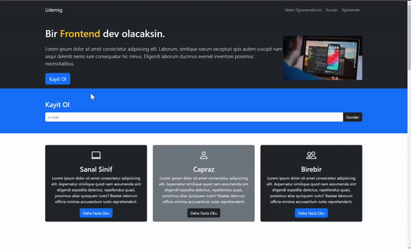

<h1> Udemig Kurs Projesi</h1>

Bu proje, web geliştirme temellerini öğrenmeyi amaçlayan bir kurs sitesidir.

<h2> Bolumler </h2>

<ul>
<li>Neler Ögreneceksiniz?</li>
<li>Sorular</li>
<li>Egitmenler</li>
</ul>

<h2> Kullanilan Teknolojiler </h2>
<ul>
<li>HTML5</li>
<li>CSS</li>
</ul>

<h2>Ekran Görüntüsü</h2>

